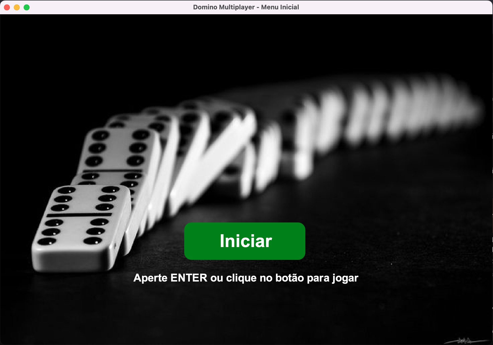
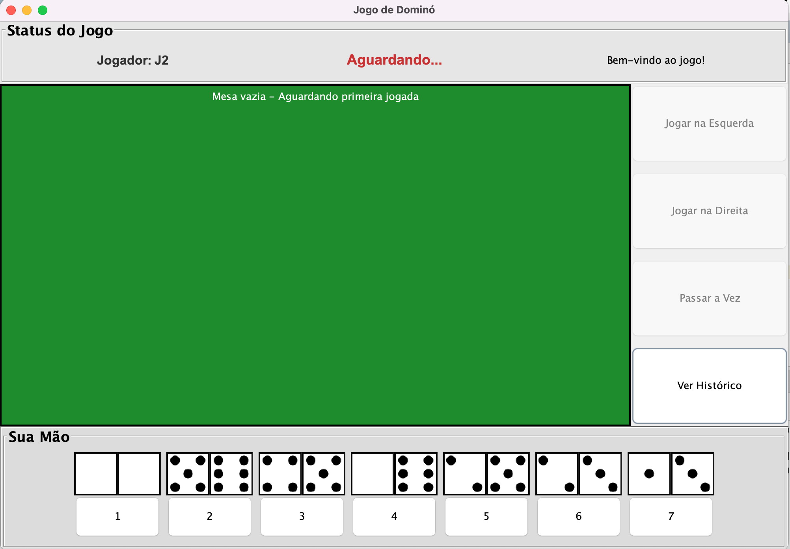
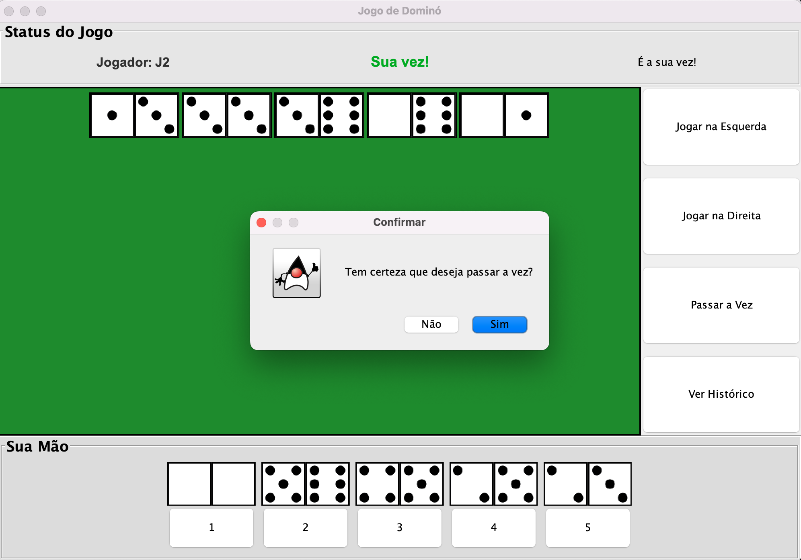
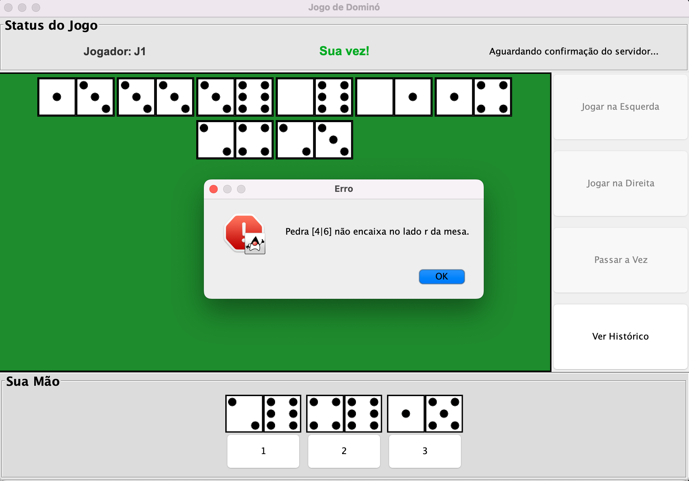
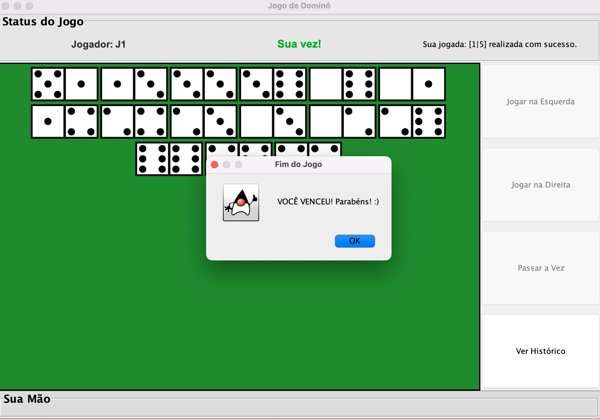
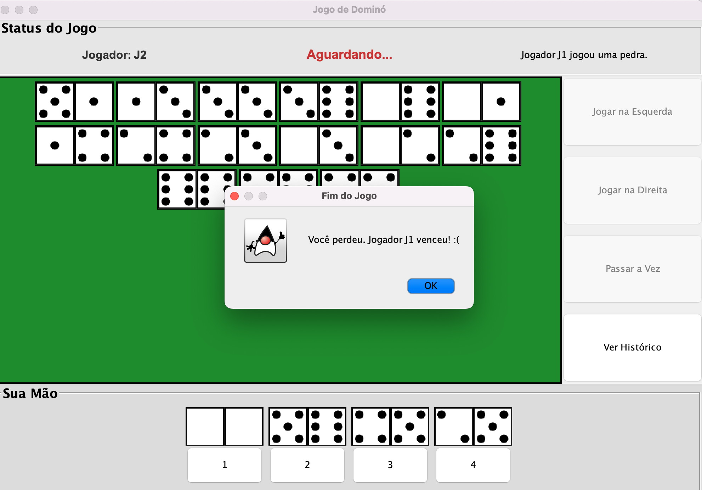
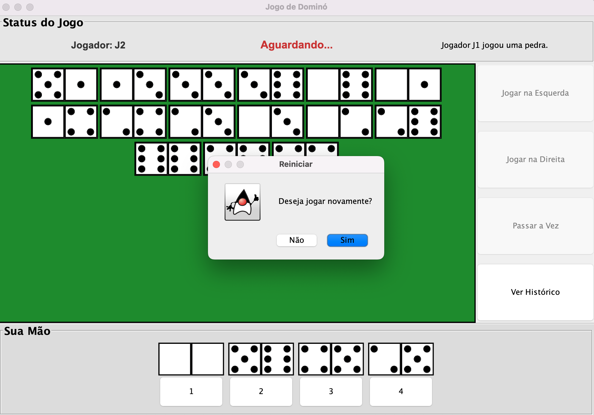
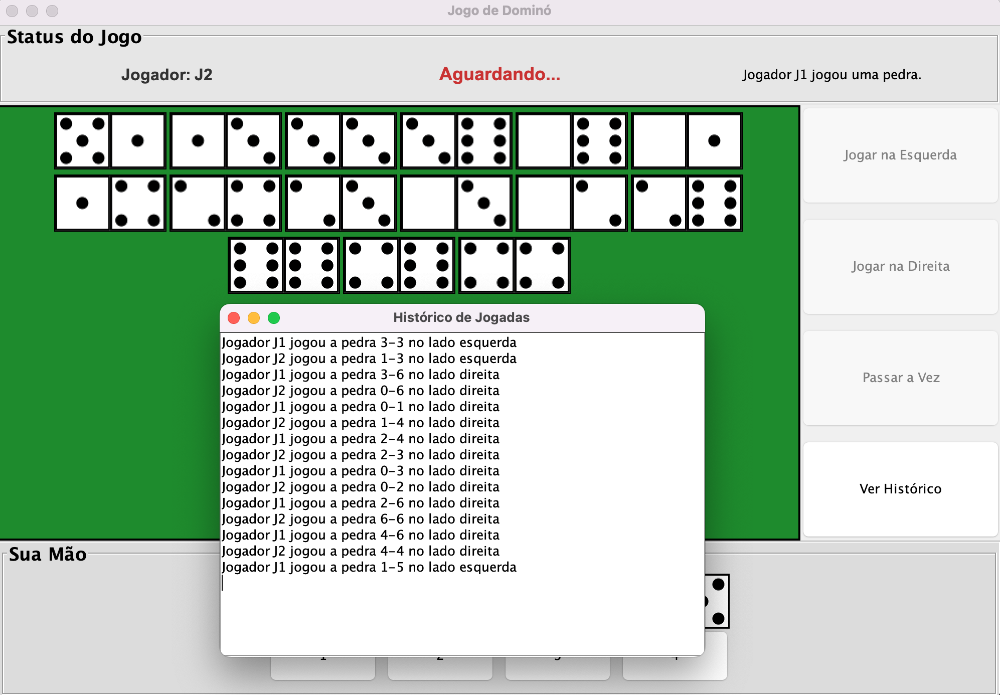

# 🎲 Domino Multiplayer - Jogo de Dominó em Java

Este projeto teve como intuito a implementação do clássico jogo Dominó como trabalho na disciplina de Desenvolvimento Orientado a Objetos (ARQDEOO) do IFSP - Campus Araraquara, utilizando Java e Java Swing para Interface Gráfica, para conceitos e técnicas de Programação Orientada a Objetos utilizando Encapsulamento, Herança, Polimorfismo, Abstração, Threads, Rede, Leitura e Escrita de Arquivos XML. O jogo persiste em dois jogadores que podem se conectar via rede em que cada jogador recebe peças aleatórias e, em turnos alternados, tenta encaixar suas peças nas extremidades do tabuleiro virtual.

Com uma arquitetura cliente-servidor robusta, o jogo segue as regras tradicionais do dominó, garantindo uma experiência autêntica e competitiva.

## 🎮 Funcionalidades Principais
- **Modo Multiplayer Online** – Conecte-se com um amigo e jogue em tempo real, explorando a arquitetura cliente-servidor para uma comunicação fluida.
- **Regras Clássicas do Dominó** – O jogo segue as regras tradicionais, garantindo a correta distribuição de peças, validação de jogadas e finalização da partida.
- **Sistema de Turnos Inteligente** – O gerenciamento de turnos é automático e robusto, assegurando que cada jogador tenha a sua vez de jogar.
- **Compra de Peças Automática** – Se um jogador não puder realizar uma jogada, ele compra peças automaticamente do monte.
- **Detecção de Fim de Jogo** – O jogo detecta automaticamente a vitória por peças zeradas ou o fim por "tranco", quando não há mais jogadas possíveis.

## ⚙️ Tecnologias e Padrões Utilizados

| Componente            | Descrição                                     |
|-----------------------|-----------------------------------------------|
| Java Swing            | Biblioteca de classes para a construção da Interface Gráfica do Usuário (GUI).   |
| Java Socket           | Comunicação cliente-servidor.                 |
| Orientação a Objetos  |  Classes bem definidas (Pedra, MesaDeJogo, etc) |
| Threads               | Processamento paralelo para múltiplos jogadores e suas ações simultaneamente.|  
| Arquivos XML          | Utilizado para leitura e escrita de dados, como o histórico de partidas.|
                                            

## 🖼️ Telas do Jogo

### Menu inicial

<p align="center">
  
</p>

### Mesa de jogo (início)

<p align="center">
  
  
</p>

### Feedbacks (GUI)

<h3 align="center">Passar a vez</h3>
<p align="center">
  
</p>

<h3 align="center">Erro de jogada</h3>
<p align="center">
  
</p>

<h3 align="center">Fim de jogo</h3>
<p align="center">
  
  
</p>

<h3 align="center">Reiniciar</h3>
<p align="center">
  
</p>

### Histórico XML

<p align="center">
  
</p>

## 📥 Instalação

Certifique-se de ter o Java e o JDK24 instalados

Clone este repositório:

  ```bash
     https://github.com/RafaelMatiass/domino-multiplayer.git
  ```
## 🚀 Como Jogar?

### 1️⃣ Inicie o Servidor

  ```bash
    java -cp bin conexao.ServidorDomino
  ```
O servidor aguardará conexões dos jogadores.

### 2️⃣ Conecte os Jogadores

  ```bash
    java -cp bin jogo.JogoDomino
  ```

- Cada jogador deve executar este comando em um terminal separado.

⚠️ **Importante**: Para conectar em rede o jogador 1 deve configurar o arquivo config.xml com seu ip e o jogador 2 deve configurar o config.xml com o ip do jogador 1. Deste modo, o jogador 1 executará o servidor e o cliente 1, enquanto o jogador executará o cliente 2 apenas, somente assim poderá ser execeutado em rede e simultaneamente.

### 3️⃣ Comandos do Jogo

- jogar esquerda/direita → Jogar uma peça

- passar a vez → Passar a vez e automaticamente compra um peça e a vez continua a ser do próprio jogador

- ver histórico → Ver as jogadas feitas até o presente momento (XML)

## 🏆 Regras do Jogo

📌 Total de 28 peças, 14 no pote para compra.

📌 Cada jogador começa com 7 peças.

📌 O jogador 1 começa com qualquer peça.

📌 Só é possível jogar nas extremidades da mesa.

📌 Se não puder jogar, o jogador passa a vez e compra peças do monte.

### Fim do jogo:

- A partida termina quando um jogador zera suas peças. Ele é o vencedor!

- Em caso de "tranco" (sem jogadas possíveis), vence o jogador com a menor pontuação em mãos.

## 📊 Arquiteura do Jogo

O projeto segue um modelo cliente-servidor simples, onde o servidor é responsável por gerenciar a lógica do jogo (como a distribuição de peças e a validação de jogadas), e os clientes (jogadores) se conectam para interagir.

```bash
graph TD
    subgraph Cliente
        Jogador1[Jogador 1]
    end
    subgraph Cliente
        Jogador2[Jogador 2]
    end
    subgraph Servidor
        Servidor[Servidor Domino]
    end

    Jogador1 --> |Conexão| Servidor
    Jogador2 --> |Conexão| Servidor
    Servidor --> |Envio de estado do jogo| Jogador1
    Servidor --> |Envio de estado do jogo| Jogador2
```

## 🛠 Próximas Atualizações (Roadmap)

🔹 Modo Singleplayer contra uma IA: Adicionar um modo para jogar sozinho, com um oponente controlado pelo computador.

🔹 Sistema de Ranking e Histórico de Partidas: Gravar e exibir as vitórias, derrotas e pontuações dos jogadores.

🔹 Chat Integrado: Permitir a comunicação por texto entre os jogadores durante a partida.

## 👨‍💻 Autores
- [Otavio Baroni](https://github.com/otaviobaroni)
- [Rafael Matias](https://github.com/RafaelMatiass)
- [Thomaz Segreto](https://github.com/Thomaiiz)
